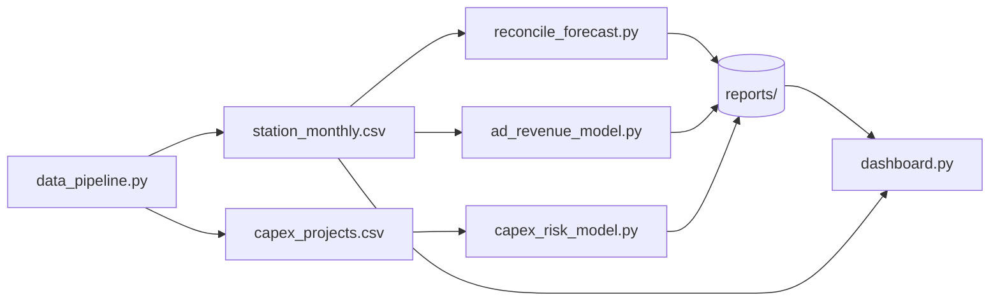

# Repository Index

A map of this repository: code structure, documentation and dependencies. Use it to find things quickly, or as a reference if you index the repo with a code-search or documentation tool.

## Documentation

| File | What it covers |
|---|---|
| [`README.md`](README.md) | Problem, results, data limits, quick start |
| [`docs/GLOSSARY.md`](docs/GLOSSARY.md) | Definitions of every finance, forecasting and ML term used |
| [`data/data_dictionary.md`](data/data_dictionary.md) | Field-level definitions for both datasets |
| [`INDEX.md`](INDEX.md) | This file |
| Author profile | [github.com/bhupesh-debug](https://github.com/bhupesh-debug), related repositories listed in the README |

## Code Structure

### `src/`
| File | Purpose | Key functions | Reads | Writes |
|---|---|---|---|---|
| `data_pipeline.py` | Generate synthetic data | `generate_stations`, `generate_monthly`, `generate_capex`, `main` | none | `data/synthetic/*.csv` |
| `reconcile_forecast.py` | Base forecasts, reconciliation, rolling backtest, station flags | `base_forecast`, `summing_matrix`, `shrink_cov`, `reconcile`, `mape`, `backtest`, `flag_stations` | `station_monthly.csv` | `reports/reconciliation_results.json`, `reports/station_flags.csv` |
| `capex_risk_model.py` | CapEx overrun classifier with recall-targeted threshold | `pick_threshold`, `main` | `capex_projects.csv` | `reports/capex_results.json` |
| `ad_revenue_model.py` | Compare revenue models with and without political/sports drivers | `build`, `fit_eval`, `main` | `station_monthly.csv` | `reports/ad_revenue_results.json` |
| `dashboard.py` | Streamlit consolidation view | n/a (script) | `reports/*`, `station_monthly.csv` | n/a |

### `tests/`
| File | Checks |
|---|---|
| `test_reconciliation.py` | 17-station hierarchy shape; reconciled enterprise forecast equals the sum of station forecasts for bottom-up, top-down and MinT; enough training history at the first backtest origin |

### Other
| Path | Purpose |
|---|---|
| `data/synthetic/` | Generated CSVs (`station_monthly.csv`, `capex_projects.csv`) |
| `reports/` | Result JSONs, station flags, chart in `reports/screenshots/` |
| `.github/workflows/test.yml` | CI: installs requirements and runs pytest |
| `requirements.txt` | Python dependencies |

## Data Flow

Run order: `data_pipeline.py`, then any of the three model scripts, then `dashboard.py`.

## Dependencies

| Package | Used by | Used for |
|---|---|---|
| numpy | all `src/` modules | arrays, random generation, linear algebra for MinT |
| pandas | all `src/` modules | tabular data |
| statsmodels | `reconcile_forecast.py` | Holt-Winters ETS base forecasts |
| scikit-learn | `capex_risk_model.py`, `ad_revenue_model.py` | gradient boosting, ridge regression, metrics, cross-validation |
| streamlit | `dashboard.py` | dashboard |
| matplotlib | chart in `reports/screenshots/` | static results chart |
| pytest | `tests/` | test runner |

Internal imports: `tests/test_reconciliation.py` imports `data_pipeline` and `reconcile_forecast`. The `src/` modules do not import each other; they communicate through files.

## Indexing Status

If a code-hosting or documentation tool shows "Repository Not Indexed," that scan is triggered from the tool itself once the repo is pushed and accessible to it. Indexing typically takes 2-10 minutes. This file gives the same structure, documentation map and dependency view without waiting for it.
