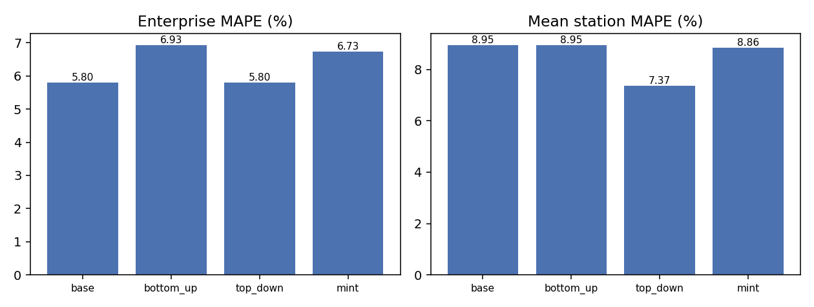
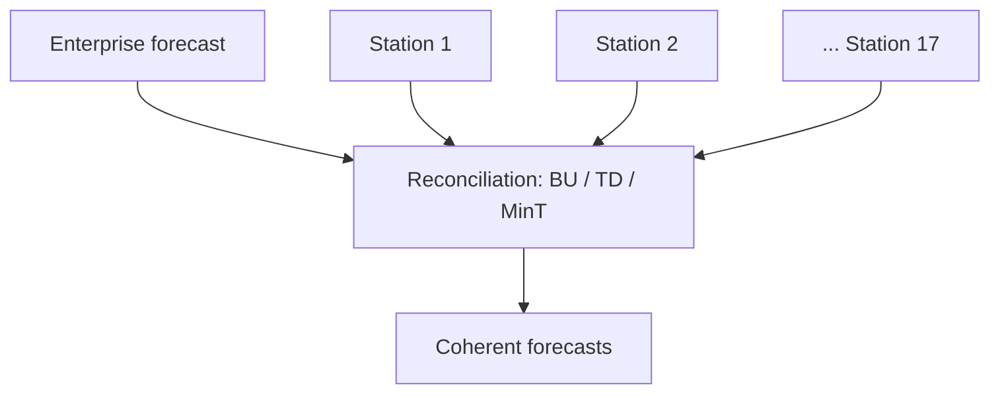

# Hierarchical Forecast Reconciliation for Multi-Station Broadcast FP&A

> Seventeen station forecasts have to add up to one enterprise number. This repo finds where they don't, and compares the reconciliation methods that fix it.



## The Problem

A broadcast group consolidates monthly forecasts from many independent station markets into one enterprise view. Two things go wrong when this is manual:

1. A station whose forecast diverges from trend is missed, or caught only at consolidation, after the local input was submitted.
2. Bottom-up (sum of stations) and top-down (enterprise-level) numbers disagree, and there is no principled way to decide which to trust.

Local broadcast revenue also has two drivers that ordinary time-series models handle badly: **election-year political ad spend** and **live sports scheduling**.

## What This Repo Does

| Module | Question it answers | Output |
|---|---|---|
| `reconcile_forecast.py` | Do station forecasts add up to the enterprise forecast? Which reconciliation method is best? | Bottom-up vs top-down vs MinT backtest, station divergence flags |
| `capex_risk_model.py` | Which capital projects are likely to overrun? | Overrun probability per project, thresholded for high recall |
| `ad_revenue_model.py` | How much revenue swing comes from political cycles and sports events? | With/without-driver comparison on held-out months |
| `dashboard.py` | Where should an analyst look first? | Streamlit consolidation view |

## Why Reconciliation, Not Just Forecasting

Forecasting each station independently is a solved problem. The analytical value is in the **disagreement between levels**. This repo implements bottom-up, top-down, and MinT reconciliation (shrinkage covariance) and compares them on the same backtest, because choosing the method is itself a judgment call.



## Results

Rolling-origin backtest: 8 folds, 6-month horizon, Holt-Winters ETS base forecasts, seed 42. Reproduce with the commands in Quick Start.

**Reconciliation (MAPE, %, lower is better)**

| Method | Enterprise | Mean station |
|---|---|---|
| Base (unreconciled) | 5.80 | 8.95 |
| Bottom-up | 6.93 | 8.95 |
| Top-down | 5.80 | 7.37 |
| MinT | 6.73 | 8.86 |

Unreconciled enterprise and station forecasts disagreed by 2.15% on average.

**What this shows.** MinT improved on bottom-up at both levels (6.93 to 6.73 enterprise), but did not beat the unreconciled enterprise forecast, and top-down was best at station level. I did not expect this and have not tuned it away. The base ETS models ignore the political cycle, so their errors are correlated across stations and reconciliation cannot fix a shared bias. The next step is adding known covariates (`is_election_year`, `major_sports_event`) to the base models and re-running the comparison.

**CapEx overrun classifier** (gradient boosting, 400 projects, 25% holdout)

| Overrun base rate | Threshold | Test recall | Test precision | Test AUC |
|---|---|---|---|---|
| 41.7% | 0.25 (chosen for 85% recall on CV) | 0.857 | 0.419 | 0.612 |

Precision is roughly the base rate, so at this recall target the model is barely better than flagging every project. The synthetic signal is weak by construction and the holdout is about 100 projects, so treat this as a working pipeline rather than a validated model.

**Ad revenue drivers** (train 2017-2023, test 2024-2025, R² on station-indexed revenue)

| Model | R², all test months | R², election-year months |
|---|---|---|
| Trend + seasonality | 0.446 | 0.489 |
| + election year, political window, sports | 0.949 | 0.959 |

## Data and Its Limits

The dataset is **synthetic**, generated by `src/data_pipeline.py` with a fixed seed. Election and sports effects are injected by the generator, so the jump in R² shows the pipeline can *recover a known effect*, not that the effect exists in real stations. Validating on real data (for example, publicly available political ad filings) is the next step.

Field definitions: [`data/data_dictionary.md`](data/data_dictionary.md). Unfamiliar term? See the [glossary](docs/GLOSSARY.md). Repo map: [`INDEX.md`](INDEX.md).

## Quick Start

```bash
git clone https://github.com/bhupesh-debug/station-forecast-reconciliation
cd station-forecast-reconciliation
pip install -r requirements.txt
python src/data_pipeline.py
python src/reconcile_forecast.py
python src/capex_risk_model.py
python src/ad_revenue_model.py
streamlit run src/dashboard.py
pytest -q
```

## Repo Structure

```
├── src/            pipeline, reconciliation, CapEx model, ad revenue model, dashboard
├── data/           synthetic data + data_dictionary.md
├── docs/           GLOSSARY.md (all terms defined)
├── INDEX.md        repo map: code, docs, dependencies
├── tests/          coherence and no-lookahead checks
├── reports/        result JSONs, station flags, chart
├── .github/        CI workflow
└── requirements.txt
```

## Limitations

- Synthetic data: effects are recovered, not discovered.
- Base forecasts do not use the political and sports covariates yet, which limits what reconciliation can achieve.
- CapEx labels are simulated with weak signal; real project history would change the threshold choice.
- The dashboard has been run locally against generated reports but is not deployed.

## Tech Stack

Python · pandas · statsmodels · scikit-learn · Streamlit · pytest

## Related Work

Other repositories by the same author on GitHub:

| Repository | Language | Link |
|---|---|---|
| FinancialAnalyst | Python | [github.com/bhupesh-debug/FinancialAnalyst](https://github.com/bhupesh-debug/FinancialAnalyst) |
| faro-project | Python | [github.com/bhupesh-debug/faro-project](https://github.com/bhupesh-debug/faro-project) |
| BusinessOpstartup | n/a | [github.com/bhupesh-debug/BusinessOpstartup](https://github.com/bhupesh-debug/BusinessOpstartup) |

Full list: [github.com/bhupesh-debug](https://github.com/bhupesh-debug?tab=repositories)

## Author

**Bhupesh Chandra Dimri** · Finance and data engineering, FP&A, automation

[GitHub](https://github.com/bhupesh-debug) · [LinkedIn](https://www.linkedin.com/in/bhupeshdimri) · [Credly](https://www.credly.com/users/bhupeshdimri/badges) · [Email](mailto:bhupesh7cd@gmail.com)
